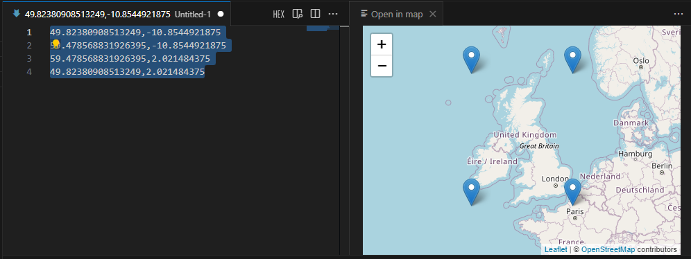

# Open in Map 🗺️

[Github](https://github.com/Patrick64/vscode-open-in-map) | [Marketplace](https://marketplace.visualstudio.com/items?itemName=kirbydigital.openinmap) | [Linkedin](https://www.linkedin.com/in/patrick-woodcock-258371a6/)

**Open in Map** is a Visual Studio Code extension that allows developers to visualize geographical coordinates directly within the editor. By simply selecting latitude and longitude values in your code, you can open a map view in a split editor and see the exact locations marked with pins.

## Features 🚀

1. **Instant Map Visualization**: Select latitude and longitude values, and see them on a map instantly.
0. **Multiple pins** Adding additional lat/lngs will add to the existing map.
0. **Interactive Map**: Pan, zoom, and explore the map right within VS Code.
0. **Elegant Animations**: New markers are shown with an expanding circle.
0. **Robust matching**: As long as the lat/lngs are comma separated it will find within arrays and other formats eg `["-20.1235,-19.236", "-12.466,23.467"]` and `<loc>-20.1235, -19.236</loc><loc>-12.466, 23.467</loc>` will work.

## Installation 💻

1. Open the Extensions view in VS Code (`Ctrl+Shift+X`).
2. Search for "Open in Map."
3. Click "Install" to install the extension.
4. Reload VS Code to activate the extension.

## Usage 🌐

1. Highlight the latitude and longitude values in your code (e.g., `51.501476,-0.140634`).
2. Use the command palette (`Ctrl+Shift+P`) and search for "Open in map."
3. Enjoy the map view in a split editor with the selected coordinates marked.

## Acknowledgments 🙏

Special thanks to the Leaflet library for providing the mapping functionality. The maps are served from Open Street Map, please consider [donating](https://donate.openstreetmap.org/) to them to keep the servers running.

## Author 👨‍💻

Developed by Patrick Woodcock, a contract software developer in the UK. [Linkedin](https://www.linkedin.com/in/patrick-woodcock-258371a6/)

## Contributing 🤝

Contributions are welcome! Feel free to open an issue or submit a pull request.

## License 📄

This project is licensed under the MIT License - see the [LICENSE](LICENSE) file for details.